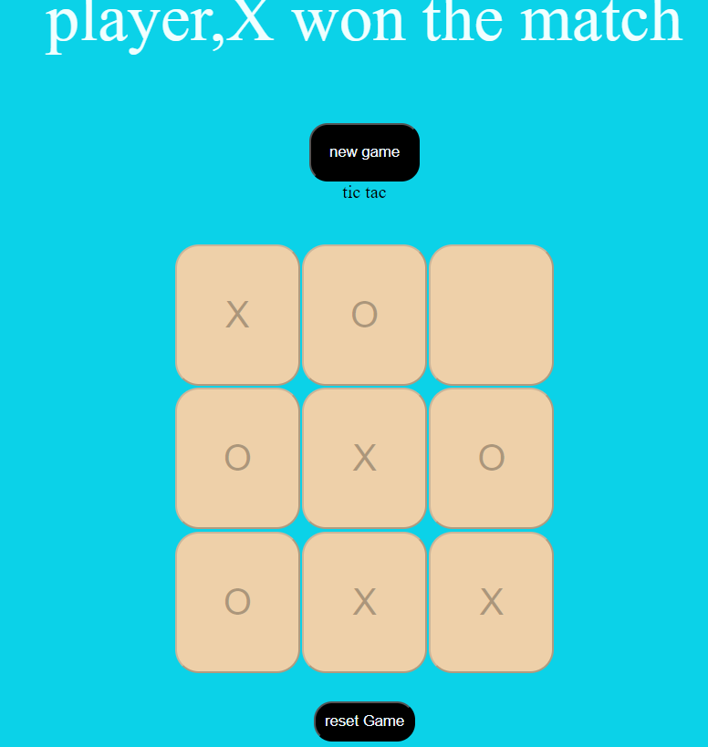

# Tic-Tac-Toe Game

A simple Tic-Tac-Toe game implemented using JavaScript, HTML, and CSS.

## Table of Contents

- [Tic-Tac-Toe Game](#tic-tac-toe-game)
  - [Table of Contents](#table-of-contents)
  - [Introduction](#introduction)
  - [Features](#features)
  - [Installation](#installation)

## Introduction

This project is a classic Tic-Tac-Toe game where two players take turns to mark spaces in a 3×3 grid. The player who succeeds in placing three of their marks in a horizontal, vertical, or diagonal row wins the game.

## Features

- Two-player game
- Turn-based play
- Win detection
- Reset and New Game functionality
- Simple and clean UI

## Installation

To run this project locally, follow these steps:

1. **Clone the repository**:
   ```sh
   git clone https://github.com/username/tic-tac-toe.git
